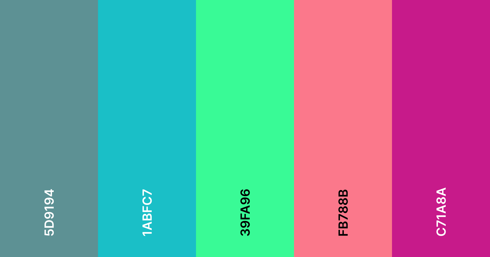

# Off the Dial public assets
This repository contains all of the public assets used for Off the Dial.
> When using any asset, please give the logo/banner some space. For example, with the logos nothing may overlap that circle or go inside of the circle. Similarly with the banners, nothing may overlap anything that we've created.

## How to access the assets
There are 2 main ways to get access to the assets:
- You can download a zip of all of the assets on the [GitHub](https://github.com/offthedial/assets) page.
- You can get a direct link to an asset by going to [`assets.otd.ink/<image>.png`](https://assets.otd.ink). *(recommended for individual images)*

## Colour Palette

## Credit
Huge thank you to @L1ttl3R3d#1003 for making the main and IDTGA logos and banners.

## Usage
If you're unsure on how you're allowed use it, please either [create an issue](https://github.com/offthedial/assets/issues/new) or [send an email](mailto:djam98@otd.ink?subject=Off%20the%20Dial%20Assets).
